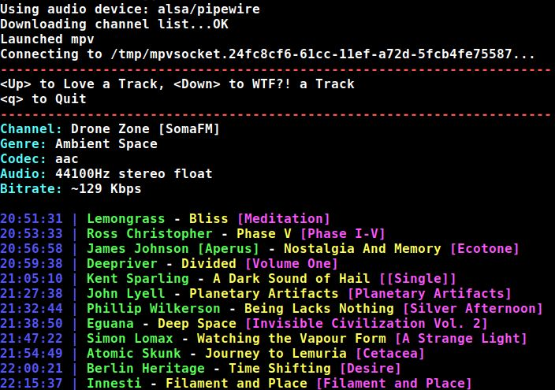

# Python SomaFM Player
This simple player for [SomaFM](https://somafm.com/) keeps the distractions, and system resource utilization, to an absolute minimum. The look of this player was inspired equally by the excellent SomaFM terminal interfaces which were already available, and the 90's hacker aesthetic that I seem to find myself nostalgic for when listening to a Shoutcast stream at 2AM.

As of the current version, the player supports completely unnecessary features like Chromecast support at no extra charge. Known to work on Linux (including Raspberry Pi and Chrome OS's Crostini), Mac OS, and even Windows.

For an up-to-date list of what's new, check the [Changelog](CHANGELOG.md)


## whorfinized
This is my fork.  Huge thanks to the original author.  I've removed support for players I don't use, simplifying the code for optimized mpv support.
The main features I've added to mpv launch are robust reconnection by leveraging playlist looping, and fast start, along with pipewire support.
Importantly, I've also fixed channel stream extraction parsing to always use the highest quality codec at the highest bitrate; previous logic was dependent on json ordering and assumed the first entry was the best, which incorrectly resulted in mp3.
Desktop notification was yeeted along with channel icon download, and the channel list is downloaded directory every launch, and not written to a file.  Caching this caused problems when channels were updated.

If you aren't me and want to try this, try the "--audio auto" flag if you aren't rocking pipewire.

## Installation
Starting with version 1.5, the stable version of this program is available on PyPi and can be installed with the following command:

```console
pip3 install somafm
```
This forked version is not backported, so you need to run it from this repository; no need to install if you don't want to, you can just run the `somafm` executable.

## Dependencies
At minimum, this program requires Python 3 versions of the following libraries:

* [colorama](https://pypi.org/project/colorama/)
* [requests](https://3.python-requests.org/)

## Channel Selection
Simply running `somafm` with no options will start streaming "Drone Zone." In the somewhat unlikely event you wanted to listen to something else, simply give it the channel name like so:

```console
somafm "DEF CON Radio"
```

Channel entry is not case sensitive and uses a certain amount of "fuzzy" matching. So rather than typing out the entire name, the following will also work:

```console
somafm def
```

Finally, if you're not sure what you want to listen to, you can pass the -r option to let the script randomly select from one of the currently active channels:

```console
somafm -r
```

## Optional Arguments
While not required for basic usage, the following arguments are also available:

#### --list
Download the latest master list of SomaFM channels and display their descriptions.

#### --stats
This option shows the number of listeners for each currently online SomaFM channel, along with a total listener count.

#### --cast
If you have the [pychromecast](https://github.com/balloob/pychromecast) library installed, this option will start playback of the given SomaFM channel on the given Chromecast device. If no device name is given, the default specified by the `chromecast_name` variable will be used.

#### --audio
I love pipewire, and by default enable it without requiring config shenanigans.
If you have yet to embrace the future, you can use this flag to chose your weapon.
`auto` will give a go at auto-detecting based on your OS defaults, while `help` will probe and list available devices.

## Supported Player
This program is simply a front-end, playback requires mpv to be installed:
* [mpv](https://mpv.io/)

## About SomaFM


SomaFM is a listener-supported Internet-only radio station. That means no advertising or annoying commercial interruptions. SomaFM's mission is to search for and expose great new music which people may otherwise never encounter.

If you like what you hear on SomaFM and want to help, please consider visiting their site and [making a donation](https://somafm.com/support/).

## License
This program is free software; you can redistribute it and/or modify it under the terms of the GNU General Public License version 3 as published by the Free Software Foundation.


This program is distributed in the hope that it will be useful, but WITHOUT ANY WARRANTY; without even the implied warranty of MERCHANTABILITY or FITNESS FOR A PARTICULAR PURPOSE.

For details, see the file "COPYING" in the source directory.
